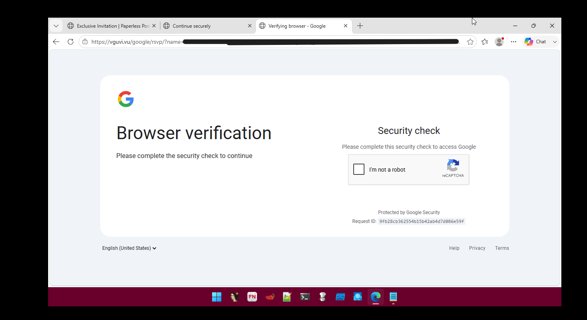
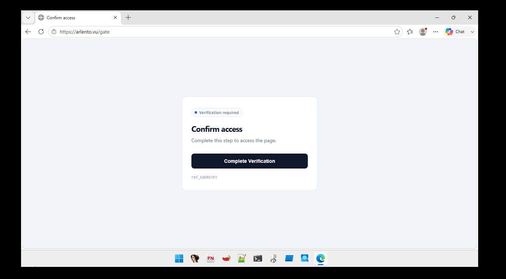
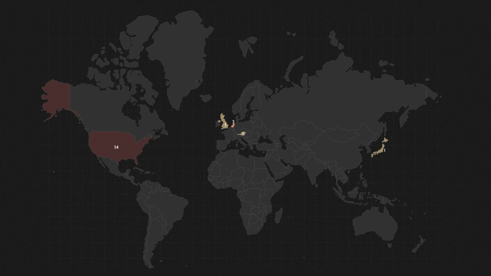

# Multi-Stage RSVP Phishing Campaign Investigation

## Executive Summary

This investigation documents a multi-stage phishing campaign that evolved over several weeks and targeted multiple organizations before later spreading to a university community. Between June 24th and July 3rd the campaign progressed from credential harvesting to malware delivery. The campaign consistently used RSVP-themed social engineering lures, compromised email accounts, Cloudflare-protected infrastructure, and victim tracking to increase effectiveness.

Three primary infrastructure components were identified:

| Stage | Infrastructure | Purpose |
|---------|---------|---------|
| Stage 1 | VGUVI | Credential Harvesting |
| Intermediate | Arlento | Proof-of-Work Gated Infrastructure (Undetermined Purpose) |
| Stage 2 | Krishimarket | Malware Delivery |

The earliest observed infrastructure, **VGUVI**, impersonated Google authentication pages and actively harvested victim credentials. **Arlento**, instead, introduced a custom browser-based proof-of-work verification system but could not be fully analyzed due to backend restrictions. The final observed infrastructure, **Krishimarket**, abandoned credential theft in favor of delivering a signed MSP360 Remote Monitoring and Management (RMM) installer through a fake CAPTCHA workflow.

---

# Campaign Infrastructure

## Shared Characteristics

All observed campaign components shared several operational themes:
- RSVP-Based Social Engineering
  - Each stage utilized invitation-themed messaging designed to encourage urgency and victim interaction.
- Cloudflare Protection
  - All observed infrastructure operated behind Cloudflare services, complicating direct backend analysis and increasing resiliency.
- Compromised Sender Accounts
  - Campaign emails were distributed through previously compromised accounts, increasing apparent legitimacy and improving delivery success.
- Victim Tracking
  - Multiple stages implemented mechanisms for monitoring victim activity, including:

---

# Stage 1 – Credential Theft (VGUVI)

## Overview

The earliest observed infrastructure was hosted on:

```text
vguvi.vu
```


The infrastructure impersonated Google authentication workflows and attempted to harvest victim account credentials.

Victims were initially directed through Short.io tracking URLs before reaching a Google-themed phishing portal protected by legitimate Google reCAPTCHA services.

---

## Credential Harvesting Workflow

```text
Email
  │
  ▼
Short.io Tracking URL
  │
  ▼
Google reCAPTCHA
  │
  ▼
Username Collection
  │
  ▼
Password Collection
  │
  ▼
Waiting Page
  │
  ▼
Sign-In Request Page
```

---

## Analysis

Several characteristics suggest real-time account compromise:

### Session-Aware Tracking

The phishing kit maintained state information through PHP sessions, allowing operators to track individual victims throughout the authentication workflow.

### session ID

A randomly generated session_id would be generated upon reaching the landing page. This ID was required in order to navigate the rest of the website, as demonstrated below.
```text
pages/login.php?session_id=<Redacted>
```

### Victim Heartbeat Monitoring

Analysis identified a periodic heartbeat mechanism communicating with:

```text
/google/rsvp/update_online.php
```

every three seconds.

This functionality likely provided operators with visibility into active victim sessions.

### Use of Legitimate Services

Rather than implementing a fake CAPTCHA, VGUVI integrated Google's legitimate reCAPTCHA service to increase credibility and reduce suspicion.

### Delayed Authentication Workflow

Following credential submission, the phishing page introduced a deliberate delay before redirecting victims to a page claiming that a Google sign-in request had been sent. This is likely giving time for real authentication attempts against the legitimate Google account to be done using the harvested credentials. Victims would then receive a legitimate Google two-factor authentication prompt generated by the attacker's login attempt and may be more likely to approve the request because the phishing workflow had already conditioned them to expect it.

### Objective

Primary campaign objective:

```text
Credential Theft
```

# Intermediate Infrastructure – Arlento

## Overview

Arlento represented a significant technical departure from the VGUVI credential phishing kit.

Victims were redirected to:

```text
https://arlento.vu/gate
```

where access was restricted through a browser-based proof-of-work (PoW) verification mechanism.


---

## Anti-Analysis Characteristics

### Proof-of-Work Gating

Unlike traditional CAPTCHA systems, Arlento utilized JavaScript-based SHA-256 proof-of-work calculations.

Observed components included:

* Browser Web Workers
* Client-side hashing
* Backend challenge issuance
* Validation endpoints

### Cloudflare Restrictions

Requests to backend services consistently returned:

```text
HTTP 403 Forbidden
```

preventing acquisition of a valid challenge.

### Result

Because the challenge process could not be completed, the ultimate purpose of Arlento remains undetermined. Though, a screenshot from a friend shows it may have been a credential stealer similar to Vguvi.


---

# Stage 2 – Payload Dropper (Krishimarket)

## Overview

On July 3, 2026, the campaign transitioned from credential harvesting to malware delivery.

Infrastructure:

```text
krishimarket.com
```

Unlike VGUVI, the objective was no longer account compromise but deployment of remote administration software.

---

## Delivery Workflow

```text
Victim Arrival
      │
      ▼
 Fake CAPTCHA
      │
      ▼
 Victim Profiling
      │
      ▼
 Telegram Alert
      │
      ▼
 Automatic Redirect
      │
      ▼
 Download Page
      │
      ▼
 Cloudflare R2 Payload
      │
      ▼
 MSP360 Installer
```

---

## Analysis  


### Fake CAPTCHA

The site presented a fake captcha on a page disguising itself as an RSVP verification page.
Unlike VGUVI, the captcha was entirely attacker-controlled.

### Victim Profiling

Following interaction with the captcha the site collected:

* Public IP address
* Geographic location
* ISP information
Victim details were transmitted directly to attacker-controlled Telegram infrastructure.

### Automatic Download

Victims were then redirected to a page where JavaScript initiated a download without additional user input.  
Click [here](campaign/payload_dropper/analysis/telegram_infastructure.md) to view the Telegram analysis!  
Below is a geographic heatmap of users who interacted with the captcha and were redirected to the malware install.


# Payload Analysis

## Delivered File

**Filename**

```text
VIP_INVITATION_E_CARD_rmm_v2_5_0_67_oidca3c87b7_a585_4f32_8343_6ca8a8aade3a.exe
```

**SHA-256**

```text
108ef7e628d7a20bd6241a5b57149e27a6061f467123eb64061975559f8f73dc
```

**File Size**

```text
17,896,424 bytes
```

**Installer Framework**

```text
NSIS v2.51
```

---

## MSP360 RMM

The delivered executable contained a signed MSP360 Remote Monitoring and Management (RMM) Agent.

Use of legitimate software to hide malicious activity is known as living off the land (LOL or LOTL). Specific instances, in our case, an RMM would then be called a LOLRMM. 
Hiding behind a legitimate RMM software aids the attacker in gaining access to an environment where the toll may already be present or less suspicious.

Potential capabilities include:

* Remote desktop access
* File transfer
* Command execution
* System administration
* Payload staging

---

## NSIS Wrapper Analysis

The installer utilized a customized NSIS wrapper around the MSP360 software.

Observed functionality included:

### Process Termination

```text
taskkill /F /IM <process> /T
```

### Temporary Staging

Payload execution occurred from:

```text
%TEMP%
```

rather than standard installation paths.

### Log Manipulation

Installation logs were relocated into temporary directories controlled by the installer.  

### Persistence
The installer modifies Windows firewall rules to allow UDP traffic on port 48678.
It also creates an autostart registry entry in `HKEY_LOCAL_MACHINE\SOFTWARE\Microsoft\Windows\CurrentVersion\Run` for both "RMM Agent" and "RMM Tray App Launcher,"   
#### Click [here](https://www.joesandbox.com/analysis/1925086/0/html#deviceScreen) for a detailed breakdown of the malware on JoeSandbox
---

# Anti-Analysis and Evasion Techniques

## Arlento

* Proof-of-work challenge system
* Browser-side SHA-256 computations
* Cloudflare-protected backend
* Restricted challenge issuance

## VGUVI

* Legitimate Google reCAPTCHA
* Cloudflare reverse proxy
* Session-aware workflows
* session_ID required for navigation

## Krishimarket

* Legitimate code-signed software
* Cloudflare R2 payload hosting
* LOLRMM deployment

---

# MITRE ATT&CK Mapping

| Tactic | Technique | ID | Description |
|----------|----------|----------|----------|
| Resource Development | Acquire Infrastructure: Domains | T1583.001 | Multiple domains used for phishing and malware delivery. |
| Resource Development | Acquire Infrastructure: Web Services | T1583.006 | Cloudflare services and R2 storage leveraged for hosting. |
| Initial Access | Spearphishing Link | T1566.002 | RSVP phishing emails directed victims to attacker infrastructure. |
| Reconnaissance | Gather Victim Network Information: IP Addresses | T1590.005 | Client-side scripts collected victim public IP address, ISP information, and geolocation data through third-party services. |
| Credential Access | Phishing | T1566 | Google-themed credential collection via VGUVI. |
| Credential Access | Web Portal Capture | T1056.003 | Google-themed credential harvesting portal captured victim authentication information. |
| Collection | Gather Victim Network Information | T1590 | Public IP and ISP profiling conducted before payload delivery. |
| Defense Evasion | Masquerading | T1036 | Malware disguised as a legitimate RMM disguised as an invitation. |
| Defense Evasion | Subvert Trust Controls: Code Signing | T1553.002 | Legitimate MSP360 signature used to increase trust. |
| Defense Evasion | System Binary Proxy Execution | T1218 | Native Windows utilities leveraged during installation. |
| Defense Evasion | Impair Defenses: Disable or Modify System Firewall | T1562.004 | Windows Firewall modified to allow UDP traffic on port 4867. |
| Defense Evasion | Obfuscated/Compressed Files and Information | T1027 | NSIS deployment logic was intentionally difficult to analyze and required significant simplification during reverse engineering. |
| Execution | Command and Scripting Interpreter | T1059 | NSIS wrapper executed Windows shell commands. |
| Execution | User Execution: Malicious File | T1204.002 | Victims downloaded and executed a malicious installer disguised as a VIP invitation. |
| Persistence | Registry Run Keys / Startup Folder | T1547.001 | Persistence established via Windows Run key modification under HKLM. |
| Persistence | Remote Access Software | T1219 | MSP360 RMM deployed to maintain remote access and ongoing management capabilities. |
| Command and Control | Ingress Tool Transfer | T1105 | MSP360 installer retrieved from attacker-controlled Cloudflare R2 infrastructure. |
| Command and Control | Application Layer Protocol | T1071 | Web-based protocols used for attacker communications and infrastructure interaction. |
| Command and Control | Web Service | T1102 | Telegram infrastructure leveraged for operational communications and victim-data handling. |
| Exfiltration | Exfiltration Over C2 Channel | T1041 | Collected credentials, IP addresses, ISP information, and geolocation data transmitted through Telegram Bot API infrastructure. |  

---

# Indicators of Compromise (IOCs)

## Campaign Infrastructure

| Type | Value | Description |
|----------|----------|----------|
| Credential Harvesting Domain | `vguvi.vu` | Google-themed credential phishing infrastructure. |
| Unknown Infrastructure Domain | `arlento.vu` | Proof-of-work gated infrastructure with undetermined post-verification behavior. |
| Malware Delivery Domain | `krishimarket.com` | Primary malware delivery infrastructure. |
| Redirect Domain | `partylillianrsvp.icu` | Redirected victims to Arlento infrastructure. |
| Tracking Domain | `nct0pyi.s.gy` | Short.io URL shortener used within phishing emails. |

---

## Observed URLs

| Type | Value | Description |
|----------|----------|----------|
| VGUVI Landing Page | `https://vguvi.vu/google/rsvp/` | Initial credential harvesting page. |
| VGUVI Login Page | `/google/rsvp/pages/login.php` | Username collection page. |
| VGUVI Password Page | `/google/rsvp/pages/password.php` | Password collection page. |
| VGUVI Waiting Page | `/google/rsvp/pages/waiting.php` | Victim holding page shown during authentication workflow. |
| VGUVI Sign-In Request Page | `/google/rsvp/pages/sign_in_request.php` | Prompted victims to approve a Google authentication request. |
| VGUVI Heartbeat Endpoint | `/google/rsvp/update_online.php` | Session monitoring endpoint polled approximately every three seconds. |
| Arlento Landing Page | `https://arlento.vu/gate` | Proof-of-work verification portal. |
| Arlento Endpoint | `/c4a8b2` | Observed challenge-related endpoint. |
| Arlento Endpoint | `/v9f3e1` | Observed validation endpoint. |
| Arlento Endpoint | `/get-session` | Observed session-related endpoint. |
| Krishimarket Landing Page | `https://krishimarket.com/rsvp/invitation/` | Fake CAPTCHA page used for victim profiling. |
| Krishimarket Download Page | `https://krishimarket.com/dload.html` | Automatically initiates malware download. |

---

## Payload Hosting Infrastructure

| Type | Value | Description |
|----------|----------|----------|
| Cloudflare R2 Bucket | `pub-626480847b854b77889f6730d12642ee.r2.dev` | Hosted the malware payload distributed during the final campaign stage. |

---

## Attacker Infrastructure

| Type | Value | Description |
|----------|----------|----------|
| Telegram Bot Token | `8892723652:AAHzlqOzjviiYXE08ygioj7N1WdZ1prdRNg` | Used by client-side JavaScript to notify operators of victim interactions. |
| Telegram Chat ID | `7683234319` | Destination Telegram chat used for campaign notifications. |
| IPInfo API Token | `d149ece627b483` | Used to retrieve victim geolocation and ISP information. |

---

## Victim Profiling Services

| Service | Purpose |
|----------|----------|
| `api64.ipify.org` | Retrieved victim public IP addresses. |
| `ipinfo.io` | Retrieved geographic and ISP information associated with victim IP addresses. |
| `api.telegram.org` | Delivered victim notifications to attacker-controlled Telegram infrastructure. |

---

## Malware

| Type | Value | Description |
|----------|----------|----------|
| Filename | `VIP_INVITATION_E_CARD_rmm_v2_5_0_67_oidca3c87b7_a585_4f32_8343_6ca8a8aade3a.exe` | Malware payload delivered through Krishimarket infrastructure. |
| Installer Framework | `NSIS v2.51` | Customized installer wrapper used to deploy the payload. |
| Embedded Software | `MSP360 RMM Agent` | Legitimately signed remote monitoring and management software. |
| File Size | `17,896,424 bytes (17.07 MB)` | Delivered executable size. |
| SHA-256 | `108ef7e628d7a20bd6241a5b57149e27a6061f467123eb64061975559f8f73dc` | Primary file hash. |
| MD5 | `386529af136fe96a23da6aaa39711e2b` | Secondary file hash. |

---

## Campaign Artifacts

| Type | Value | Description |
|----------|----------|----------|
| Social Engineering Theme | RSVP / Invitation | Consistent theme used throughout all observed campaign stages. |
| Email Distribution Method | Compromised Accounts | All observed phishing emails originated from previously compromised university accounts. |
| URL Shortening Service | Short.io (`s.gy`) | Used to generate individualized tracking links for phishing recipients. |
| Infrastructure Protection | Cloudflare | Consistently used across all observed infrastructure components. |

---

# Conclusion

The investigated infrastructure is an evolving phishing operation that progressed from credential theft to direct malware deployment. VGUVI focused on harvesting Google account credentials, Arlento introduced a proof-of-work gating mechanism that hindered analysis, and Krishimarket delivered a signed MSP360 RMM agent using a fake CAPTCHA button and Telegram based victim monitoring. This campaign shows consistent infrastructure management, shared phishing themes, and active victim tracking. The campaign seems to have no specific target, instead, it propagates from compromised accounts and continues to hit various organizations as it spreads.
