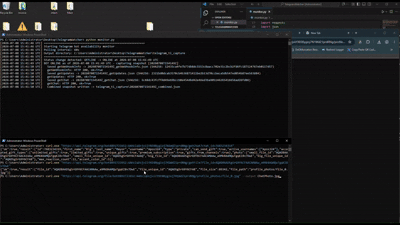
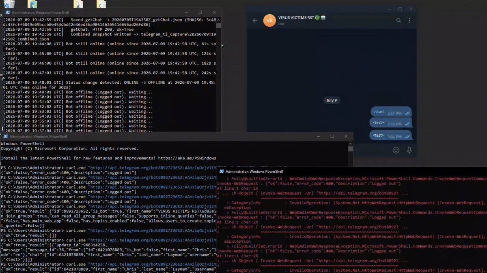

# Telegram Infrastructure

## Overview

Unlike the earlier campaign stages, the Krishimarket infrastructure used direct integration with Telegram to provide near real-time notification of victim activity.

Analysis of the client-side JavaScript identified a hardcoded Telegram Bot API token and chat identifier used to transmit victim profiling information collected during the fake CAPTCHA process.

This allowed the campaign operator to receive notifications immediately after victim interaction and before malware delivery occurred.

---

## Bot Metadata

The embedded token corresponds to the following Telegram bot:

| Field | Value |
|---------|---------|
| Bot ID | `8892723652` |
| Bot Name | `VIRUS VICTIMS RST🦠🤖` |
| Username | `@VirusOTPresult_Bot` |
| Type | Telegram Bot |

The bot name is particularly notable as it explicitly references "victims" and appears to have been created specifically for collecting phishing or authentication-related results.

---

## Chat Metadata

Victim information was transmitted to the following Telegram account:

| Field | Value |
|---------|---------|
| Chat ID | `7683234319` |
| First Name | `B!g` |
| Last Name | `Mayor` |
| Username | `@Apos324` |
| Chat Type | `Private` |

The JavaScript submitted victim information directly to this account using Telegram's Bot API.

---

## Notification Workflow

```text
Victim Visits Site
          │
          ▼
 Fake CAPTCHA Interaction
          │
          ▼
 Public IP Collection
          │
          ▼
 Geolocation Lookup
          │
          ▼
 Telegram Bot API
          │
          ▼
 @Apos324
```

Collected information included:

* Public IP address
* City
* Country
* ISP

This data was packaged into a Telegram message and delivered to the operator-controlled account prior to payload delivery.

---

#### A friend was able to grab the actor's pfp and chat history to aid the report: 

  

as of 7/9/2026 there were 20 unique telegram entries observed.  

- 14 from the US
- 3 from the Netherlands
- 1 from Great Britain
- 1 from austria
- 1 from Japan

---

## Assessment

The use of Telegram provided several operational benefits to the attackers:

* Low-cost infrastructure.
* Real-time victim notifications.
* Reduced requirement for custom backend logging.
* Separation of victim tracking from phishing infrastructure.

The bot name, associated account, and integration within the malware delivery workflow show that Telegram served as a monitoring platform for the campaign's final observed stage.
